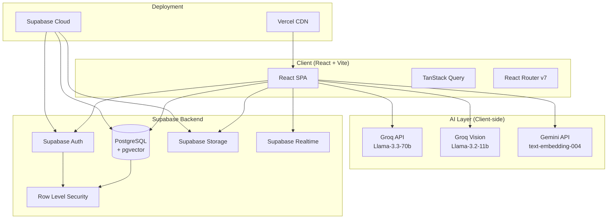
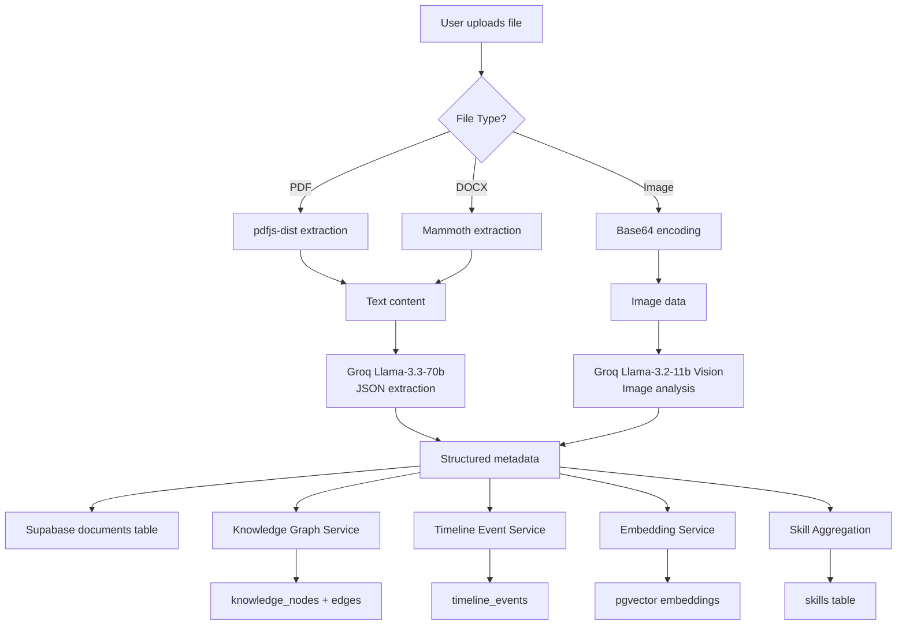
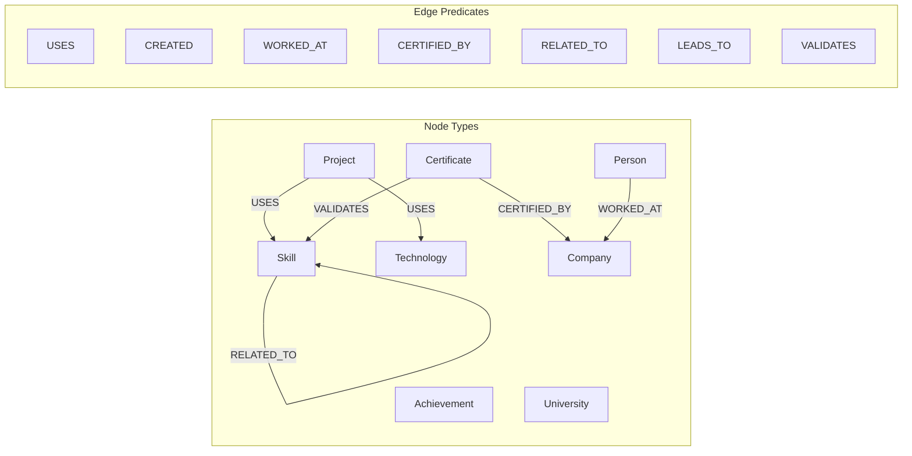
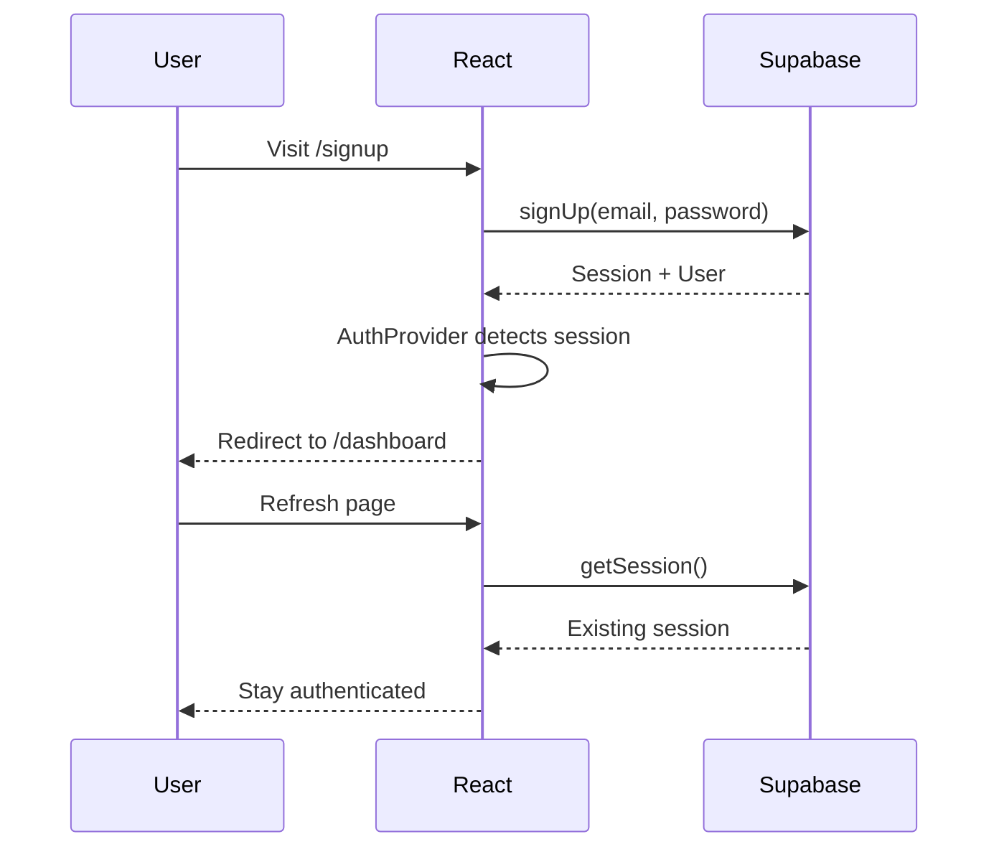
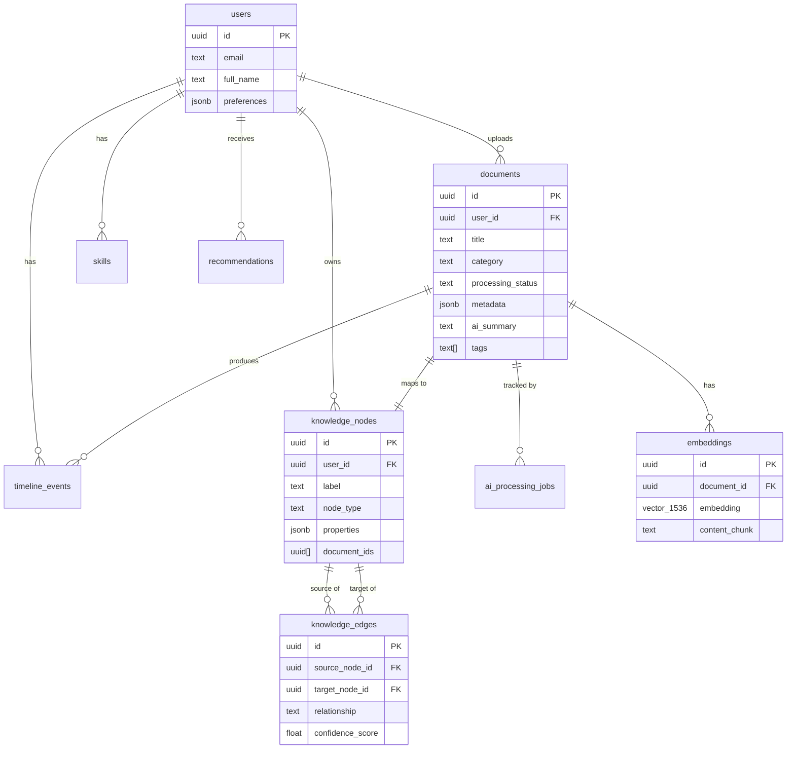
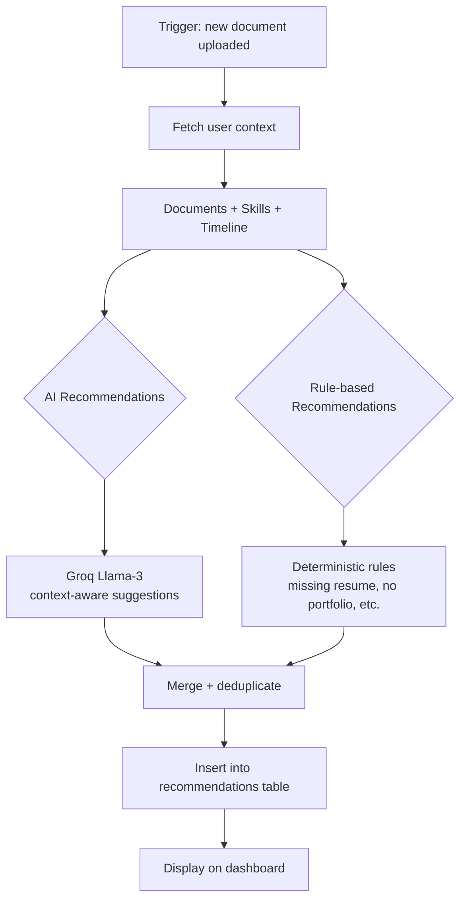
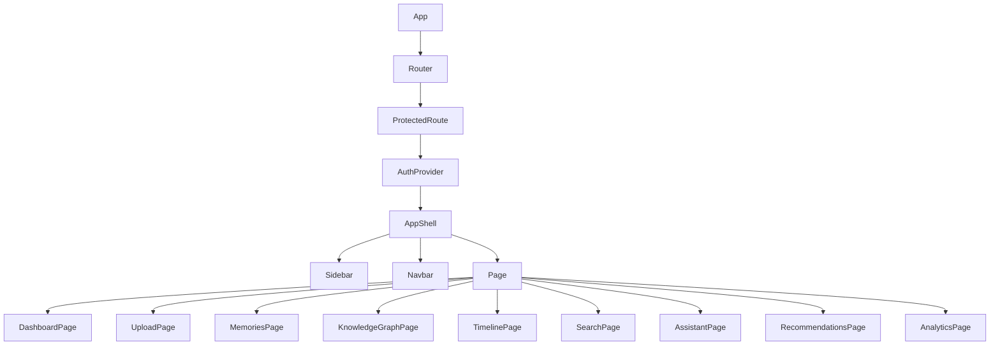

# Keepsake — Architecture

## System Overview

Keepsake is a single-page application (SPA) with a serverless backend. The frontend is a React app deployed to Vercel. The backend is entirely powered by Supabase (PostgreSQL, Auth, Storage, Realtime).

---

## Architecture Diagram

---

## Document Processing Pipeline

---

## Knowledge Graph Architecture

---

## Authentication Flow

---

## Database Relationships

---

## Recommendation Engine Flow

---

## Frontend Component Flow

